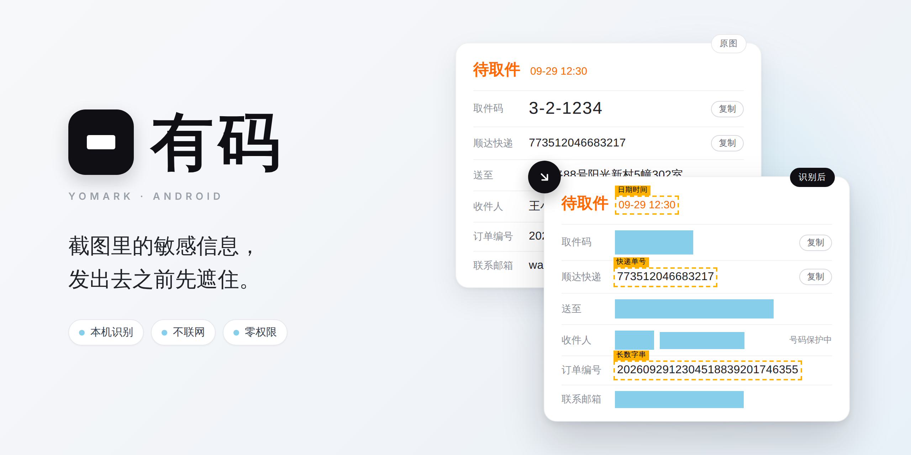
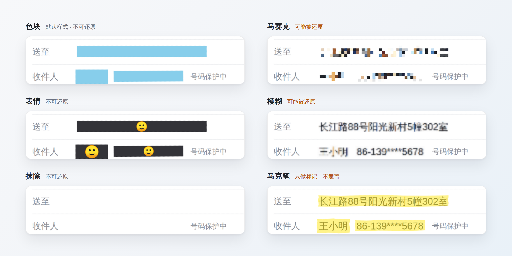

<p align="center">
  
</p>

<p align="center">
  <a href="https://github.com/FlintyLemming/yomark/releases"></a>
  <a href="https://github.com/FlintyLemming/yomark/actions/workflows/android-apk.yml"></a>
  
</p>

<p align="center">自动找出截图里的手机号、地址、人名、取件码、人脸、二维码等敏感信息并打码。<br>识别、编辑、导出全部在手机上完成，应用没有联网权限，也不申请任何运行期权限。</p>

## 功能

- **自动识别**：内置 PP-OCRv5 文字识别，配合规则引擎判断哪些内容属于敏感信息；人脸和条码由 ML Kit 的离线模型识别。
- **两级处理**：有把握的直接打码，拿不准的只用虚线框圈出来，点一下就能切换。导出前如果还有圈出但未打码的内容，会先提醒。
- **六种样式**：色块、表情、抹除、马赛克、模糊、马克笔，每一块码各用各的样式。色块的颜色、表情和底色、马赛克的粗细、模糊的强度、马克笔的颜色和浓淡都能调，还能用吸管从图上取色。预览和导出使用同一套渲染器，所见即所得。
- **手动补框**：单指拖出一个框补上漏掉的地方，双指缩放和平移。
- **批量处理**：从相册一次分享多张图，逐张处理后一起导出。
- **用途水印**：在整张图上平铺一行文字，例如「仅供办理签证使用」，被挪作他用时一眼就能认出来。
- **干净导出**：按原图分辨率重新绘制并编码，不保留任何 EXIF 信息。

## 使用

1. 在首页选一张图，或者在相册里把图分享给「有码」。
2. 等待识别完成，通常只需一两秒。识别时画面上有一道扫光；也可以在设置的「外观」里换成「磨砂」：整页模糊、闪着细碎的光点，中间转着等待图标，识别完从中心散开。识别完画面上会出现两种标记：天蓝色块是已经打码的，琥珀色虚线框（带类型标签）是识别到了但默认不打码、等你确认的。点一下标记就能在两种状态之间切换。
3. 有漏掉的地方，用一根手指拖出一个框。画完可以直接拖四个角调大小、拖中间挪位置，框上方的「删除」可以删掉它；之后想再改，点一下框就行。
4. 想换个样子，点底部样式栏上的一种样式，下方会弹出它的调节面板（颜色、表情、粗细等）。样式只管接下来的打码：新画的框、点了打码的虚线框用新样式，已经打好的码不变；刚画完（或点选中）的框会跟着面板一起变。想让整张图都换成这样，点面板上的「应用到全部」。
5. 点「导出」。如果还有圈出但未打码的内容，会先列出来让你再确认一次（可在设置的「导出」里关闭这个提醒）。

自动识别出来的框只能在「打码」和「圈出」之间切换，不能删除，避免误删后再也找不回来。手动框反过来：点它不切换状态，而是选中它来调整或删除。

界面的主题色默认跟随系统的壁纸取色（Android 12 及以上），也可以在设置的「外观」里换成紫、蓝、青、绿、橙、红、粉中的一种。

## 识别范围

| 默认直接打码 | 默认只圈出，等你确认 |
|---|---|
| 电话、邮箱、人名、地址、取件码 | 快递单号、长数字串（订单号、交易号等） |
| 银行卡号、IBAN、护照号、社保号 | 日期时间 |
| 密钥（API key）、MAC 地址 | 网址、IP 地址 |
| 人脸、能解码的二维码和条形码 | 无法解码的疑似条码（条码设为「宽松」时） |

每一类都可以在设置里改成「打码」「仅圈出」或「关闭」：文字按类型逐条设，人脸和条码各一项，另外还各有自己的识别模式（快速 / 精确、严格 / 宽松）。

## 打码样式

<p align="center">
  
</p>

| 样式 | 效果 | 可以调 | 导出后能否还原 |
|---|---|---|---|
| 色块 | 不透明色块，默认天蓝色 | 颜色：预设、自定义、吸管取色 | 不能 |
| 表情 | 不透明底色上放表情 | 表情、底色、单个或排满一行 | 不能 |
| 抹除 | 用周围的颜色把区域填平 | 背景太复杂时改用的色块颜色 | 不能 |
| 马赛克 | 像素化 | 颗粒粗细（只能比默认更粗） | 可能。截图的字体固定、背景干净，马赛克可以被逐字还原 |
| 模糊 | 高斯模糊 | 强度（只能比默认更强） | 可能 |
| 马克笔 | 半透明高亮，只做标记 | 颜色、浓淡（最高 70%） | 不遮盖内容 |

样式栏选的是接下来打码用的样式，换样式不会改动已经打好的码；需要整张图统一时，用调节面板上的「应用到全部」。调好的样子会记住，下次打开沿用。

选择后三种时，样式栏下方会显示提示。需要真正隐藏信息时请使用色块、表情或抹除。马赛克还原的实测记录见[上架验收记录](docs/release-checklist.md)。

## 导出与水印

- 导出在原图分辨率上重新绘制、重新编码。EXIF 里的位置、机型、拍摄时间一律不保留。
- 用途水印的颜色、角度、透明度和密度都可以调，带实时预览。
- 开源版全功能免费，导出的图片不带品牌水印。首页和编辑器右上角的按钮仍在，点开会说明这一点，并提供打赏入口：点「打赏」会用系统浏览器打开 <https://pay.mitsea.com>，应用自己不发任何网络请求。
- 以后上架 Play 商店的版本会恢复内购：免费导出时右下角带一个「有码 Yomark」小水印（自动避开打码区域），一次性买断或输入兑换码可以去掉。那也是唯一的付费项，其他功能不受限制。

## 隐私与权限

- 不申请任何运行期权限。选图通过系统的 Photo Picker 完成，应用只能拿到你选中的那几张图，读不到相册里的其他图片。
- 没有网络权限。ML Kit 的依赖会把 `INTERNET` 和 `ACCESS_NETWORK_STATE` 带进 manifest，构建时会把这两条移除，系统层面就不会给这个进程开网络。
- 构建任务 `assertDebugNoRuntimePermissions` 会检查合并后的 manifest。除了下面三条不涉及数据访问的声明，多出任何一条权限都会让构建失败：
    - `com.android.vending.BILLING`：Play 内购，购买在 Play 商店的进程里进行。开源版不连 Play Billing，留给以后上架的版本。
    - `com.google.android.apps.aicore.service.BIND_SERVICE`：「AI 复查」绑定系统的 AICore，模型在本机运行。
    - `com.yomark.app.DYNAMIC_RECEIVER_NOT_EXPORTED_PERMISSION`：androidx 自动生成的 signature 级权限，其他应用无法获取。

## 实现

- **文字识别**：默认使用 PP-OCRv5 mobile（ONNX Runtime，模型随安装包分发）。它对中文截图里带星号的号码、生僻字人名识别效果好，并能给出单字级别的框。设置里可以切换到 ML Kit 的拉丁或中文模型，也可以让两者同时运行。
- **敏感信息判断**：由规则决定，不交给模型。规则由正则和校验位组成（银行卡 Luhn、IBAN mod 97、UPS 单号等），电话用 libphonenumber 解析，人名用 HanLP 的离线词典。每条命中都可以解释原因，也都有单元测试。
- **人脸与条码**：ML Kit 的 bundled 版本，模型同样随包分发。
- **AI 复查**：在支持 AICore 的机型上，编辑器里会多出这个按钮。点击后由本机的 Gemini Nano 把整页文字再读一遍，新发现的内容只圈出，不会自动打码。

## 下载

在 [Releases](https://github.com/FlintyLemming/yomark/releases) 下载 APK：真机装 `arm64-v8a`，模拟器装 `x86_64`。安装包是 debug 构建、固定签名，可以直接覆盖升级。

每次推送后，GitHub Actions 也会打一份 APK，可以在对应运行的 Artifacts 里下载。推送 `v*` 标签，或者在 Actions 页面手动触发并填写版本号，单元测试通过后会自动发布 Release，说明取自 `docs/release-notes/<版本号>.md`。

## 构建

需要 JDK 21 和 Android SDK 36。最低支持 Android 10（minSdk 29）：从这一版开始，应用读写自己创建的图片不需要存储权限，这是零权限的前提。

```sh
./gradlew :app:assembleDebug              # APK 按 ABI 拆分：真机装 arm64-v8a，模拟器装 x86_64
./gradlew :app:testDebugUnitTest          # Robolectric；PP-OCR 用桌面版 ONNX Runtime 跑真模型
./gradlew :app:connectedDebugAndroidTest  # 需要连接设备或模拟器
```

## 项目结构

```
app/src/main/java/com/yomark/app/
  core/      几何、图片读取、打码方案（MaskPlan）的数据模型
  engine/    OCR、人脸、条码的封装，候选去重合并
  rules/     敏感信息规则与校验位
  render/    六种样式的渲染器，预览和导出共用
  export/    原图重绘、品牌水印、用途水印、写入相册
  ui/        首页、编辑器、设置（Jetpack Compose）
  billing/   发行版本开关（开源版免费）、去水印的一次性购买与兑换码
docs/        设计文档、模型调研、上架验收记录
tools/       模型评测、测试语料、主题配色表和落地页小图的生成脚本
site/        落地页，纯静态，由 .github/workflows/pages.yml 部署到 GitHub Pages
```

设计上的取舍见[总体方案](docs/superpowers/specs/2026-09-02-yomark-android-design.md)，各项指标的实测数值见[上架验收记录](docs/release-checklist.md)。

---

<sub>头图用样图的内容排版合成，其中的人名、地址、号码都是虚构的；样式对照图裁自 `ReadmeScreenshots` 在 Robolectric 上用真实识别流程拍下的编辑器截图。重新生成的方法见 [docs/readme/src/render.cjs](docs/readme/src/render.cjs)。</sub>
